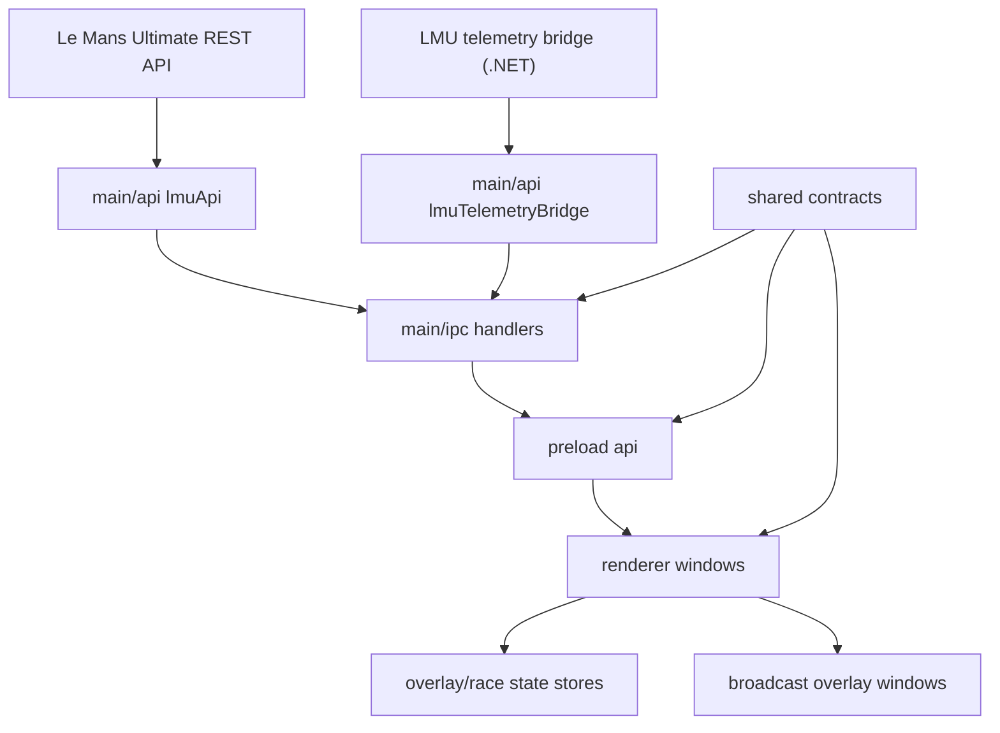
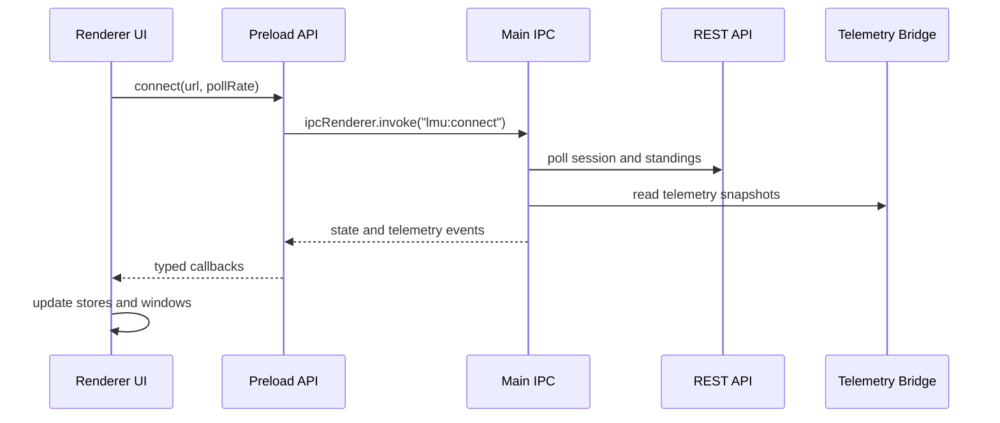
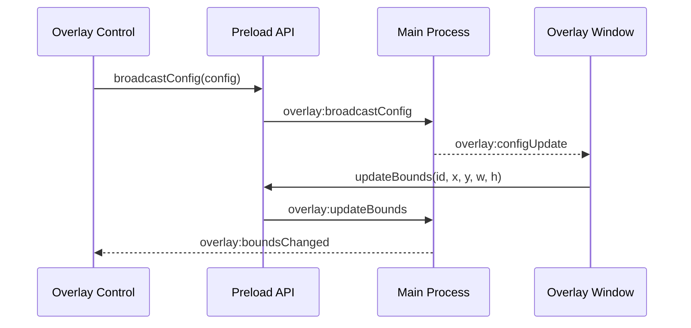

# Architecture

RaceDirector is an Electron desktop app for controlling Le Mans Ultimate broadcast overlays. The
app is split into four main layers: Electron main, preload IPC, React renderer windows, and shared
contracts.

## Layers

### Electron Main

The main process owns OS-level behavior and external integrations:

- REST API connection and polling
- telemetry bridge process access
- window lifecycle and overlay window positioning
- updater integration
- preset file dialogs and persistence

Renderer code should not call Electron or Node APIs directly. Add main-process behavior behind a
small IPC handler and expose only the needed method from preload.

### Preload Bridge

The preload layer exposes `window.api` through Electron's `contextBridge`. It is the public contract
between renderer UI and the main process.

Keep preload methods explicit and narrow. Prefer typed method names such as `overlay.savePreset` or
`updater.check` over a generic command dispatcher.

### Renderer Windows

The renderer owns UI only:

- main dashboard
- info window
- overlay control window
- broadcast overlay windows
- system dialogs and settings UI

Business logic should live in hooks, stores, shared helpers, or main-process services rather than
inside large components. Components should stay readable and focused.

### Shared Contracts

The `src/shared` directory contains types and small shared helpers used across main, preload, and
renderer. Use it for stable contracts such as overlay configuration, updater state, language,
measurement units, and LMU data models.

Avoid importing renderer-only code into shared modules. Shared files need to stay safe for both
Electron main and renderer builds.

## Runtime Flow

The renderer requests a connection through preload. The main process owns polling and broadcasts
typed state updates back to every relevant window. Overlay windows consume the same application state
as the dashboard, but render it for broadcast display.

## Overlay Flow

Overlay control changes should go through the main process so every window sees the same config and
saved bounds. Presets should remain versioned, validated, and recoverable when possible.

## Updater Flow

The updater state is centralized in the main process and exposed through the preload API. Renderer
UI should treat updater state as read-only and trigger explicit commands:

- `updater.check`
- `updater.download`
- `updater.install`

Keep updater status transitions deterministic so they can be tested without publishing real releases.

## Contribution Guidelines For Architecture Changes

- Keep UI and logic separate.
- Add shared types before duplicating contracts across main, preload, and renderer.
- Prefer small IPC methods with typed payloads over generic channels.
- Keep file persistence and OS access in the main process.